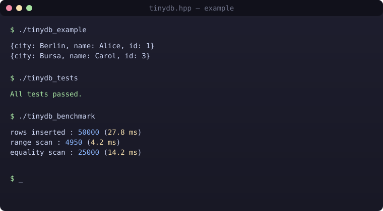
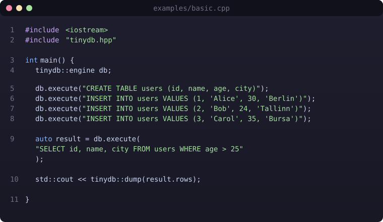

# tinydb.hpp

[](https://en.cppreference.com/w/cpp/17)
[](include/tinydb.hpp)
[](CMakeLists.txt)
[](LICENSE)
[](#)

A small, header-only, in-memory database for C++17.

`tinydb.hpp` gives you tables, rows, and a tiny subset of SQL in a single
header. It is designed for situations where you need structured, query-able
data inside a binary but pulling in SQLite (or anything larger) would be
overkill: CLI tools, test fixtures, local data pipelines, quick prototypes, and
embedded utilities.

It is intentionally small. One header, no external dependencies, no build-time
code generation, no macros to configure.

<p align="center">
  
</p>

## Table of contents

- [Features](#features)
- [Quick start](#quick-start)
- [Typed table API](#typed-table-api)
- [Supported SQL](#supported-sql)
- [Benchmark](#benchmark)
- [Build](#build)
- [Using it in your own project](#using-it-in-your-own-project)
- [Project layout](#project-layout)
- [Design notes](#design-notes)
- [License](#license)

## Features

| | |
|---|---|
| **Header-only** | Drop `include/tinydb.hpp` into your project and `#include` it. |
| **Zero dependencies** | Nothing beyond the C++17 standard library. |
| **Typed values** | `std::variant` of `null`, `bool`, `int64`, `double`, `string`. |
| **Two APIs** | A `tinydb::engine` for SQL strings and a `tinydb::table` for direct C++. |
| **Lambda predicates** | Filter rows with any callable, not just the built-in operators. |
| **CMake target** | `tinydb::tinydb` interface target, plays nicely with `add_subdirectory`. |

## Quick start

<p align="center">
  
</p>

```cpp
#include <iostream>
#include "tinydb.hpp"

int main() {
    tinydb::engine db;

    db.execute("CREATE TABLE users (id, name, age, city)");
    db.execute("INSERT INTO users VALUES (1, 'Alice', 30, 'Berlin')");
    db.execute("INSERT INTO users VALUES (2, 'Bob', 24, 'Tallinn')");
    db.execute("INSERT INTO users VALUES (3, 'Carol', 35, 'Bursa')");

    auto result = db.execute("SELECT id, name, city FROM users WHERE age > 25");
    std::cout << tinydb::dump(result.rows);
}
```

Output:

```text
{city: Berlin, name: Alice, id: 1}
{city: Bursa,  name: Carol, id: 3}
```

## Typed table API

If you do not need SQL parsing, use the table API directly. It is faster,
avoids stringly-typed queries, and lets you filter with any predicate.

```cpp
tinydb::table users({"id", "name", "active"});

users.insert({
    {"id",     std::int64_t{1}},
    {"name",   std::string("Alice")},
    {"active", true},
});
users.insert({
    {"id",     std::int64_t{2}},
    {"name",   std::string("Bob")},
    {"active", false},
});

// Built-in helpers
auto adults = users.gt("id", std::int64_t{0});

// Custom predicate
auto active = users.where("active", [](const tinydb::value& v) {
    return std::holds_alternative<bool>(v) && std::get<bool>(v);
});
```

`table::where`, `table::eq`, `table::gt`, and `table::lt` all return a
`result_set` you can iterate with `rows()`.

## Supported SQL

```sql
CREATE TABLE users (id, name, age)
INSERT INTO users VALUES (1, 'Alice', 30)

SELECT * FROM users
SELECT id, name FROM users WHERE age > 25
SELECT id, city FROM users WHERE city = 'Berlin'
```

`WHERE` supports `=`, `>`, `<`, `>=`, and `<=`. String literals use single or
double quotes. Numeric literals are parsed as `int64` when possible, otherwise
`double`. `NULL`, `true`, and `false` are recognized as literal keywords.

This is deliberately a small subset. No joins, no grouping, no subqueries, no
transactions. If you need those, use a real database.

## Benchmark

`examples/benchmark.cpp` inserts 50k typed rows and runs two scans. On a recent
laptop (`g++ -O2`, single thread) the output looks like:

```text
rows inserted : 50000 (27.8 ms)
range scan    :  4950 rows ( 4.2 ms)
equality scan : 25000 rows (14.2 ms)
```

It is not meant to compete with SQLite — it is here so that when you make a
change you can see whether it hurts the insert and scan paths.

## Build

Any C++17 compiler and CMake 3.16+.

```bash
cmake -S . -B build
cmake --build build
ctest --test-dir build
```

This produces three targets:

| Target | What it is |
|---|---|
| `tinydb_example`   | The Quick start snippet. |
| `tinydb_benchmark` | The small insert / scan benchmark. |
| `tinydb_tests`     | The test binary used by `ctest`. |

Examples and tests can be turned off when you embed the library:

```bash
cmake -S . -B build -DTINYDB_BUILD_EXAMPLES=OFF -DTINYDB_BUILD_TESTS=OFF
```

## Using it in your own project

Because the library is header-only, the easiest integration is to copy
`include/tinydb.hpp` into your project and `#include` it.

With CMake you can also consume it via `add_subdirectory`:

```cmake
add_subdirectory(third_party/tinydb.hpp)
target_link_libraries(my_app PRIVATE tinydb::tinydb)
```

Or with `FetchContent`:

```cmake
include(FetchContent)
FetchContent_Declare(
    tinydb
    GIT_REPOSITORY https://github.com/aykutsp/tinydb.hpp.git
    GIT_TAG        main
)
FetchContent_MakeAvailable(tinydb)

target_link_libraries(my_app PRIVATE tinydb::tinydb)
```

## Project layout

```
include/tinydb.hpp       header-only library
examples/basic.cpp       SQL-style usage
examples/benchmark.cpp   insert / scan microbenchmark
tests/test_basic.cpp     ctest target
docs/images/             readme assets
CMakeLists.txt
```

## Design notes

- **Values are variants.** A row is a `std::unordered_map<std::string, value>`
  where `value` is a `std::variant`. This keeps the type system honest without
  introducing a row/column type schema.
- **Tables own their rows.** Inserts copy-or-move into a `std::vector<row>`.
  Queries return a `result_set` holding projected copies, so the underlying
  table is never mutated by a read.
- **Parser is a tokenizer, not a grammar.** The SQL frontend handles exactly
  the statements documented above. Anything fancier belongs in the typed API.
- **No hidden allocations at query time beyond the result set.** Predicates
  are `std::function`, so you can inline whatever logic you need.

## License

MIT. See [LICENSE](LICENSE).

Feel free to use this project however you like — fork it, ship it, tear it
apart, build something bigger on top of it. If you end up using it in something
public, a small credit or a link back would make my day, but it's not a
requirement. Thanks for taking a look.
